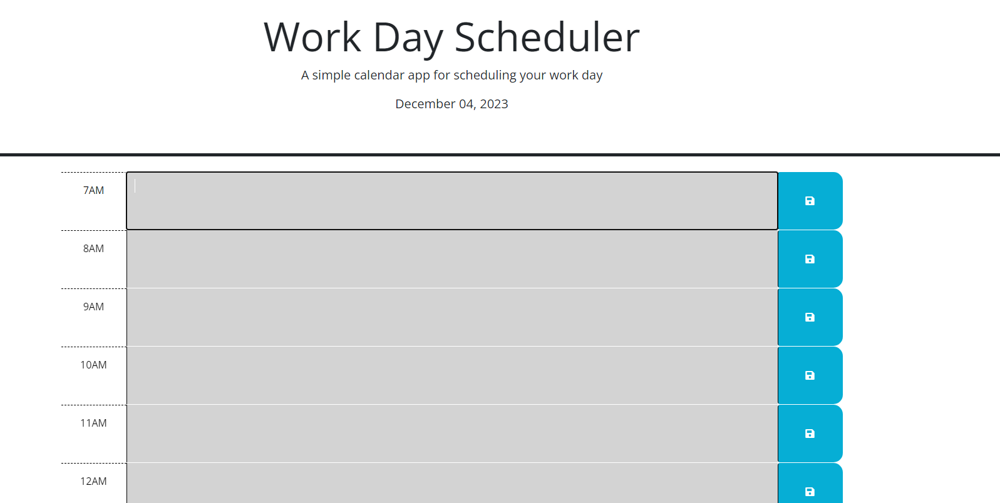

# Work-day-scheduler
## Description
The goal was to make a Work day scheduler so you can keep track if what to do for the day.
It consist of hourly time blocks if its grey it means you past that hour if its red that means its the current hour if its green that means its a future hour.
this challenge was pretty interesting since we were using dayjs and jquery it made the coding a lil more simple.

## Installation
N/A

## Usage

Just type in a box and click the save icon.

## Credits

N/A

## License
N/A